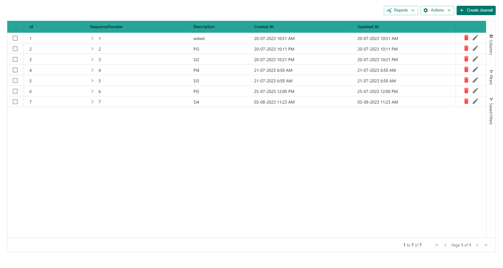
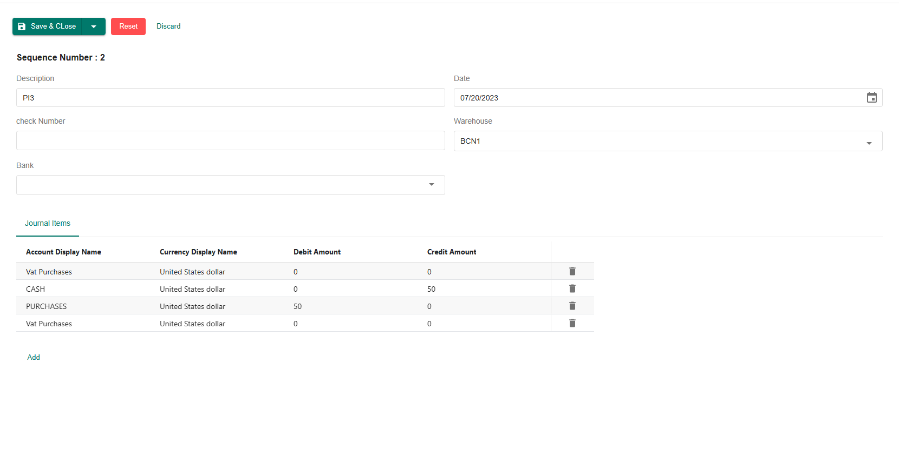
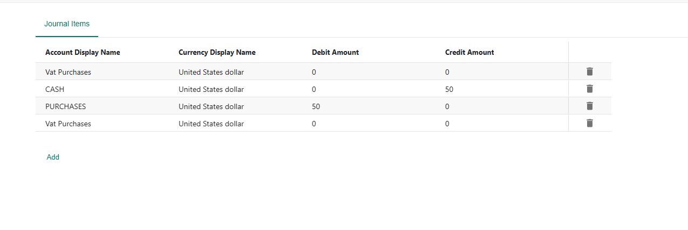

# Layout Page

## Introduction

The ERP Core is a powerful and flexible system designed to streamline various business processes. This documentation will guide you on how to create a layout page using the `<AgGridLayout>` component.

## Creation

Now, you can create the layout page using the `<AgGridLayout>` component. The code provided in your snippet defines two main sections:

- `GridLayoutHeaderProps`
- `GridProps`

```js
import AgGridLayout from "AgGrid/Layouts/AgGridLayout";
import { ENTITY } from "services/Abstractions/EntitiesNames";
import { defs } from "./components/JournalGrid";
import JournalForm from "modules/Accounting/components/Forms/JournalForm";
import JouranlItemFormTab from "../../components/Forms/JournalItemsTab";
import { JournalItemDetailCellRenderer } from "./components/JournalItemMasterDetails";
import { OpenJournalVouchierReportAsync } from "../reports/JournalVoucher";
import { JournalMapper } from "./mapper/journalMapper";
import { MenuItemData } from "components/ui/DropDown";
import { AgGridReact } from "ag-grid-react";
import { openAilyTranactionReport } from "../reports/DailyTransaction/components/handlers";

const reportDropDownItems: MenuItemData[] = [
  {
    label: "Daily Transaction Report",
    callback: (event, item, injections) => {
      const params = injections?.ref?.current as AgGridReact;
      openDailyTranactionReport(params as any)
    },
  },
];

const Journal = () => {
  return (
    <AgGridLayout
      GridLayoutHeaderProps={{
        pageName: "Journal",
        DropDownBar: {
          ReportItems: reportDropDownItems,
        },
        formProps: {
          Render: JournalForm,
          HeaderTitle: "Journal",
          mapKeysSubmission : JournalMapper,
          Tabs: [
            {
              FormTab: JouranlItemFormTab,
              label: "Journal Items",
            }
          ],
        },
      }}
      GridProps={{
        entityName: ENTITY.GENERALJOURNAL,
        ColsDefs: defs,
        detailRowAutoHeight: true,
        masterDetail: true,
        detailCellRenderer: JournalItemDetailCellRenderer,
        MenuItem(params) {
          return [
            {
              name: "Journal Report",
              cssClasses : [`show-${Boolean(params.node?.data.guid)}`],
              async action() {
                const JournalVoucherGuid = params.node?.data.guid;
                try{
                  await OpenJournalVouchierReportAsync(JournalVoucherGuid);
                }catch(err){
                }
              },
            },

          ];
        },

      }}
    />
  );
};

export default Journal;

```

## Output





## Grid Layout Header options

The `GridLayoutHeaderProps` section of the ERP Core `<AgGridLayout>` component allows you to define various options related to the header section of the layout page. Here are the available options:

### formProps

The `formProps` option is responsible for configuring the main form controller used in the header section. It provides several options to customize the behavior of the form. The properties of `formProps` are as follows:

1. **Render (required , Component)**

    Specifies the form component that you want to display.For example, you can use the `AccountTypeForm` component here.

    ```js title="AccountTypeForm.tsx"
    export function JournalForm() {
      const sequenceNumber = useWatch({ name: "sequenceNumber" });

      return (
        <Grid container spacing={2}>
          {!!sequenceNumber && (
            <Grid item xs={12}>
              <Typography variant="h5" mr={2}>
                Sequence Number : {sequenceNumber}
              </Typography>
            </Grid>
          )}

          <Grid item xs={12} md={6}>
            <ReactFormTextField
              name="description"
              Title={"accounting.journal.description"}
            />
          </Grid>

          <Grid item xs={12} md={6}>
            <ReactFormDatePicker name="date" Title={"accounting.journal.date"} />
          </Grid>

          <Grid item xs={12} md={6}>
            <ReactFormTextField name="checkNumber" Title={"check Number"} />
          </Grid>

          <Grid item xs={12} md={6}>
            <ReactFormAutoCompleteLoader
              name="warehouse"
              Loader={{ entityName: ENTITY.WAREHOUSE }}
              Title={"Warehouse"}
            />
          </Grid>

          <Grid item xs={12} md={6}>
            <ReactFormAutoCompleteLoader
              name="bank"
              Loader={{ entityName: ENTITY.BANK_NOTES }}
              Title={"Bank"}
            />
          </Grid>
        </Grid>
      );
    }
    ```

2. **HeaderTitle (required , string)**
    The HeaderTitle option is used specifically for the dialog form view. It sets the title that appears at the top of the dialog when the form component is displayed as a dialog.

3. **Tabs (Optional , `List<ITabOption>`)**

    The Tabs option is an array used to define individual tabs within the form. Each tab is represented as an object with the following properties:

    - **FormTab (required, Component):** Specifies the form component that should be displayed when the user selects this tab. It's the form associated with this particular tab.

    - **label (required, ReactNode):** Sets the title or label of the tab. This will be displayed as the name of the tab to the user.

    - **ignoreTabIf (optional, fn):** A function that, when provided, determines whether to ignore the tab based on the form values. If this function returns true, the tab will be hidden and not displayed in the form. If it returns false, the tab will be shown as usual. You can use this function to conditionally show or hide tabs based on specific data or form values.

    - **TabProps (optional, TabProps):** An object containing additional props that can be passed to the tab component. These props are typically specific to the Material-UI Tab component (MuiTabProps), so you can refer to the Material-UI documentation for more details on available props.

    - **extraProps (optional , Object):** An object containing any additional props that you want to pass to the form component associated with this tab. These props will be available in the form component.

    

4. **mapper, mapKeys, mapperForSubmission and mapKeysSubmission**

    - **mapper and mapKeys**

        - `mapper`: The mapper function is used to transform the response data received from the backend before displaying it in the form. It takes the response data as input and allows you to modify or rearrange the data to match the form's expected structure. This can be useful if the data returned from the backend needs to be adapted to fit the form's input fields or state.

        - `mapKeys`: The mapKeys object is used to specify a key-value mapping for the response data received from the backend. Only the keys specified in the mapKeys object will be included in the form, and any other keys in the response data will be omitted. This can be useful when you want to filter out unwanted data from the backend response and only focus on specific fields relevant to the form.

    - **mapperForSubmission and mapKeysSubmission**

        - `mapperForSubmission`: The mapperForSubmission function is used to transform the form data before it is submitted to the backend. It takes the form data as input and allows you to modify or rearrange the data to match the expected format required by the backend API. This can be helpful if the form data structure needs to be adapted before sending it to the server.

        - `mapKeysSubmission`: The mapKeysSubmission object is used to specify a key-value mapping for the form data before it is submitted. Only the keys specified in the mapKeysSubmission object will be included in the submission data, and any other form data keys will be excluded. This can be useful when you want to ensure that only specific fields are sent to the backend during the form submission process, preventing the transmission of unnecessary or sensitive data.

    To summarize, the key differences between mapper and mapKeys lie in their purposes:

    mapper and mapKeys are used to transform the response data received from the backend before displaying it in the form.

    mapperForSubmission and mapKeysSubmission are used to transform the form data before it is submitted to the backend.

    :::info
    Using `mapKeysSubmission` during form submission is recommended when you want to ensure that only specific, relevant data is sent to the backend, thus avoiding the transmission of unnecessary data.
    :::
